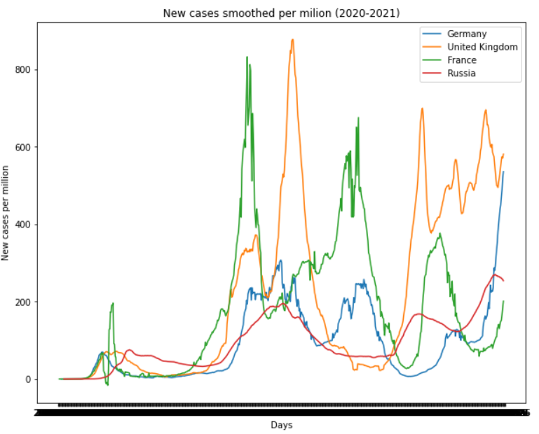
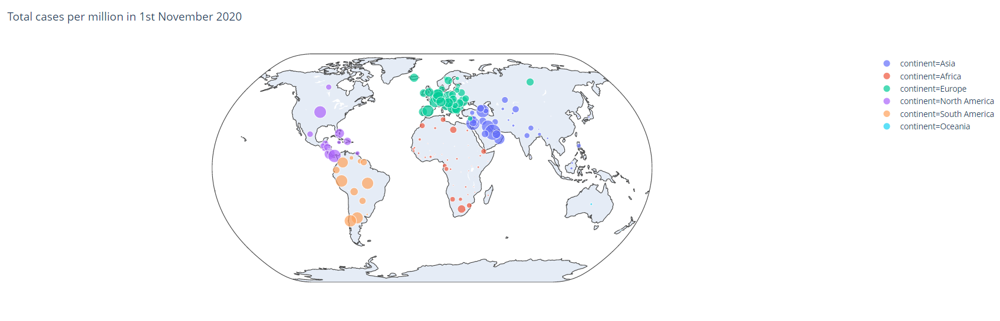

# Covid Data Visualization
Dataset: https://github.com/owid/covid-19-data/blob/master/public/data/owid-covid-data.csv  
 The purpose of this code is to visualize and analyze the data of Covid-19. To do so, After cleaning the data with some techniques, I have used some packages of Python such as Matplotlib, Seaborn, and Plotly. 
 By using the plots, we can reach some general conclusions and realize the connection between different parameters.  
 The plot below results that  through 2020 to 2021, two countries have stronger peaks than two others.
 

  

 

 Here you can see a plot that shows the total cases per million on 1st November 2020. 
 

  

